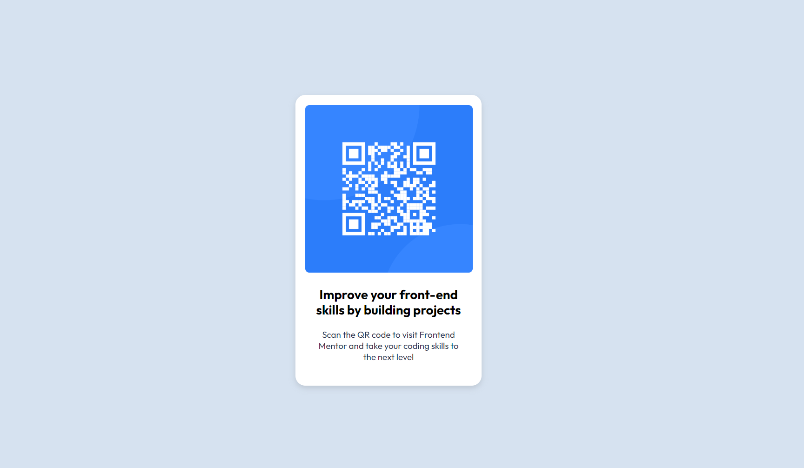

# Frontend Mentor - QR code component solution

This is a solution to the [QR code component challenge on Frontend Mentor](https://www.frontendmentor.io/challenges/qr-code-component-iux_sIO_H). Frontend Mentor challenges help you improve your coding skills by building realistic projects.

## Table of contents

- [Overview](#overview)
  - [Screenshot](#screenshot)
  - [Links](#links)
- [My process](#my-process)
  - [Built with](#built-with)
  - [What I learned](#what-i-learned)
  - [Continued development](#continued-development)
  - [Useful resources](#useful-resources)
- [Author](#author)

## Overview

### Screenshot

### Links

- Solution URL: [Add solution URL here](https://your-solution-url.com)
- Live Site URL: [Add live site URL here](https://your-live-site-url.com)

## My process

- My initial process is to layout is build out from the body of the document first and then place the card on the page.
- Once the background and card are added, I then look to flex box to center the component.
- Once the component is centered, I roughly add all the content to the card to get the basic layout
- Once the basic layout is complete, I start with sizing the image and the adding padding and margins to the inner content.
- I like to use internal card body divs to such as content and header to align text content with in the card.
- Then after I have the UI 90 percent complete, I refactor all sizes to close as spec as possible.
- Once everything looks close, I will add the drop shadow to the card.
- Finally I will double check the mobil dimensions and make specific media query changes if needed.

### Built with

- Semantic HTML5 markup
- CSS custom properties
- Flexbox

### What I learned

I leared and brushed off alot of cobwebs on laying out HTML and CSS components because I been studying Javascript. This was good practive to get the HTML and CSS brain activity flowing again.

### Continued development

I will continue to use frontend mentor as I study frontend development and design. For future development I look to get more into CSS grid for the more advanced layouts and landing page challanges

### Useful resources

- [MDM Web Docs](https://developer.mozilla.org/en-US/docs/Web/CSS/box-shadow) - This helped me becuase I forgot the box shadow syntax
- [Box shadow Examples](https://getcssscan.com/css-box-shadow-examples) - This is an amazing resource for premade box shadows. I used this to help me dial in my box shadow with inspiration to get close to the Figma file

## Author

- Website - [Joe Terlecki](https://joeterlecki.io)
- Frontend Mentor - [@joeterlecki](https://www.frontendmentor.io/profile/joeterlecki)
